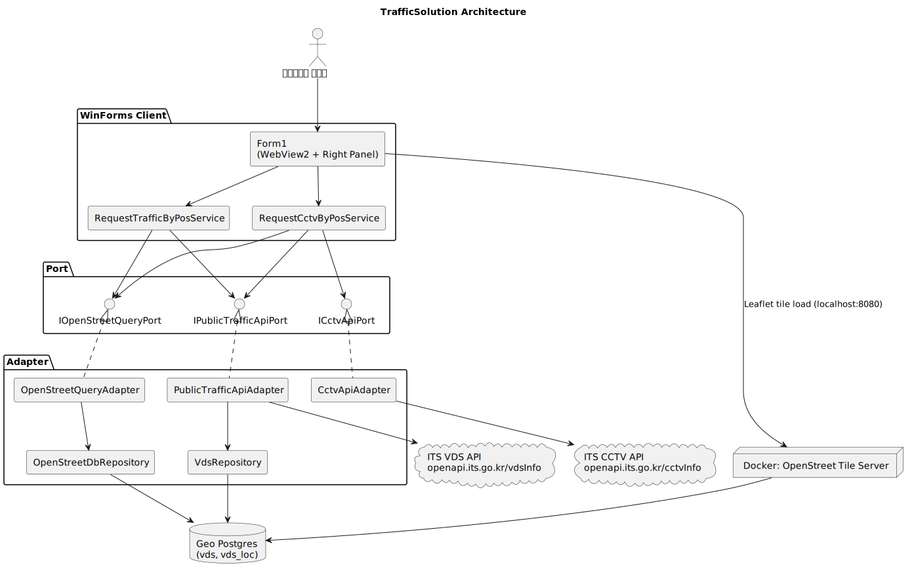
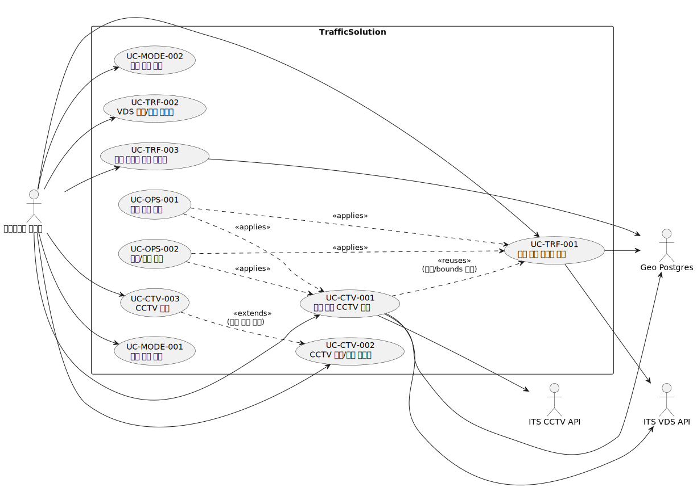

# TrafficSolution

공공데이터 API와 OpenStreetMap 기반 로컬 타일 서버를 결합해, 지도에서 선택한 좌표 기준으로 고속도로 혼잡도(VDS)와 CCTV 정보를 조회하는 .NET 10 WinForms 애플리케이션입니다.

## 핵심 목표

- 지도 중심의 교통 운영 뷰를 제공한다.
- 좌표 기반으로 주변 고속도로를 식별하고 VDS 혼잡도를 시각화한다.
- 동일한 좌표 흐름에서 최근접 고속도로 기반 CCTV 조회/재생까지 연결한다.

## 아키텍처 개요

- UI: `TrafficForm/UI/Form1.cs`, `TrafficForm/UI/Form1.Cctv.cs` (WebView2 + 우측 패널 카드 UI)
- Application Service: `TrafficForm/App/*Service.cs` (유스케이스 오케스트레이션)
- Port: `TrafficForm/Port/*.cs` (외부 의존성 추상화)
- Adapter: `TrafficForm/Adapter/*.cs` (DB/API 연동 구현)
- Domain: `TrafficForm/Domain/*.cs` (도메인 모델/정책)
- Infra: `TrafficForm/osm-local/compose.yaml` (OSM 타일/Geo Postgres)


### VDS 트래픽 스냅샷 캐시

- 문제: ITS VDS `vdsInfo` API는 필터 없이 전 VDS 응답을 내려주어, UI 요청마다 HTTP+대용량 JSON 파싱이 반복되는 병목이 발생합니다.
- 해결: 백그라운드에서 주기적으로 스냅샷을 갱신하고, 조회는 인메모리 캐시에서 수행합니다.

- 스냅샷 저장소 (`VdsTrafficSnapshotStore`)
  - `TrafficForm/Adapter/VdsTrafficSnapshotStore.cs`
  - `Volatile.Read` + `Interlocked.Exchange` 기반 원자적 스왑
  - `GetCurrent()`: 최신 스냅샷을 메모리 배리어로 읽기
  - `Swap(VdsTrafficSnapshot next)`: 원자적 스왑

- 스냅샷 소스 (`IVdsTrafficSnapshotSourcePort`)
  - `TrafficForm/Port/IVdsTrafficSnapshotSourcePort.cs`
  - `TrafficForm/Adapter/ItsVdsTrafficSnapshotSourceAdapter.cs`
  - ITS API에서 VDS 관측치를 가져와 스냅샷으로 변환
  - 중복 VDS ID가 있으면 최신 수집 날짜를 가진 관측치만 보존

- 스냅샷 리프레셔 (`IVdsTrafficSnapshotRefresherPort`)
  - `TrafficForm/Port/IVdsTrafficSnapshotRefresherPort.cs`
  - `TrafficForm/Adapter/VdsTrafficSnapshotRefresher.cs`
  - `PeriodicTimer` 기반 2분 주기 갱신
  - Overlap guard: `Interlocked.CompareExchange`로 중복 refresh 방지
  - 실패 시 마지막 성공 스냅샷 유지 (데이터 손실 방지)

- 캐시 기반 조회 어댑터 (`CachedPublicTrafficApiAdapter`)
  - `TrafficForm/Adapter/CachedPublicTrafficApiAdapter.cs`
  - `IPublicTrafficApiPort.GetTrafficResult`를 스냅샷 기반으로 구현
  - 캐시 히트 시: API 호출 없이 O(1)로 스냅샷에서 조회
  - 캐시 미스 시 (cold-start): 한 번만 API 호출 후 캐시 저장

- 동시성 해결 방법
  - 전통적인 `lock` 대신 **`Interlocked`** 및 **`Volatile`** API 사용
  - 이유: WinForms UI 스레드에서 네트워크 작업이 blocking되지 않도록
  - `Volatile.Read`: 다른 스레드가 작성한 최신 값을 반드시 읽도록 보장
  - `Interlocked.Exchange`: 스왑 연산이 원자적으로 수행됨을 보장
  - 불변 스냅샷: `VdsTrafficSnapshot`은 생성 후 변경 불가능하므로 스레드 안전

### 아키텍처 다이어그램 (PlantUML)



## 디렉토리 구조

```text
TrafficSolution/
├─ AGENTS.md
├─ README.md
├─ TrafficSolution.slnx
├─ TrafficForm/
│  ├─ Program.cs                      # Composition Root (DI 등록)
│  ├─ UI/Form1.cs                     # 지도/혼잡도 중심 UI 흐름
│  ├─ UI/Form1.Cctv.cs                # CCTV 모드 UI 흐름
│  ├─ App/                            # 유스케이스 서비스/커맨드
│  ├─ Domain/                         # 도메인 모델/정책
│  ├─ Port/                           # 외부 의존 인터페이스
│  ├─ Adapter/                        # DB/API 구현체
│  └─ osm-local/compose.yaml          # OSM 타일 + Geo Postgres Docker 구성
└─ TestProject1/                      # 단위 테스트(신규/수정 테스트 기본 위치)
```

## 기능 설계 프로세스 (도메인 → 유스케이스 → 이벤트 스토밍)

신규 기능 추가 시 아래 순서를 기본 프로세스로 사용합니다.

1. 도메인 결정
   - 기능이 속한 도메인과 경계(예: 교통 조회, CCTV 조회, 지도 상호작용)를 식별한다.
2. 액터/액션 정의
   - 클라이언트 사용자와 시스템 액터가 수행하는 행동을 정의한다.
3. 유스케이스 도출
   - 액터/액션 기준으로 사용자 시나리오를 유스케이스로 정리한다.
4. 이벤트 스토밍 수행
   - 각 유스케이스를 기준으로 Command, Event, Policy를 도출한다.
5. 설계 반영
   - Service 메서드(유스케이스), Command DTO, Domain Policy, Port/Adapter 연결을 확정한다.

### 이벤트 스토밍 산출물 템플릿

- Command: 서비스 입력(예: `UpdateSelectedPosTrafficInfoCommand`)
- Event: 상태 전이/중간 결과(예: 좌표 선택됨, 고속도로 식별됨, 조회 완료됨)
- Policy: 도메인 규칙(예: 좌표 범위 검증, 혼잡도 레벨 계산, CCTV 1km + 고속도로명 유사 필터링)

## 유스케이스 정의 (클라이언트 관점)

아래 유스케이스는 "사용자가 화면에서 무엇을 하는지"를 기준으로, 현재 코드에 구현된 흐름만 정리했습니다.

| 식별자 | 사용자가 하는 일 | 시스템 반응(클라이언트 관점) | 완료 기준 | 관련 코드 |
|---|---|---|---|---|
| UC-CMN-001 | 앱을 실행하고 지도를 기다린다 | WebView2 지도를 로드하고 상태바에 준비 상태를 표시한다 | 상태바에 `지도가 준비되었습니다.`가 표시된다 | `TrafficForm/UI/Form1.cs`, `TrafficForm/Program.cs` |
| UC-MODE-001 | 지도 모드를 `주변 고속도로 선택 모드`로 변경한다 | 마우스 커서를 조회 모드로 바꾸고 클릭 조회를 활성화한다 | 지도 클릭 시 좌표 조회 이벤트가 전달된다 | `TrafficForm/UI/Form1.cs` |
| UC-MODE-002 | 우측 패널 모드를 `혼잡도/CCTV`로 전환한다 | 우측 패널 모드만 변경하고, 기존에 생성된 하이라이트/마커를 초기화한다. 카드/마커 재생성은 이후 조회/선택 동작에서 수행된다 | 모드 전환 직후 이전 상태의 하이라이트/마커가 제거된다 | `TrafficForm/UI/Form1.Cctv.cs` |
| UC-TRF-001 | 지도에서 좌표를 클릭해 혼잡도를 조회한다 | 인접 고속도로를 찾고, bounds 내 VDS 혼잡도를 수집해 카드/마커를 생성한다 | 우측 카드와 지도 마커/구간이 함께 표시된다 | `TrafficForm/UI/Form1.cs`, `TrafficForm/App/RequestTrafficByPosService.cs`, `TrafficForm/Adapter/OpenStreetDbRepository.cs`, `TrafficForm/Adapter/PublicTrafficApiAdapter.cs` |
| UC-TRF-002 | 지도의 VDS 마커를 클릭한다 | 해당 카드로 스크롤하고 하이라이트를 동기화한다 | 지도 선택과 우측 카드 선택 상태가 일치한다 | `TrafficForm/UI/Form1.cs`, `TrafficForm/UI/HighwayListControl.cs` |
| UC-TRF-003 | 조회된 도로 구간 혼잡도를 확인한다 | VDS 책임 구간을 혼잡도 레벨 색상으로 지도에 그린다 | 구간 색이 레벨(원활/보통/혼잡/정체)에 맞게 표시된다 | `TrafficForm/UI/Form1.cs`, `TrafficForm/Domain/TrafficLevelPolicy.cs`, `TrafficForm/Adapter/VdsRepository.cs` |
| UC-CTV-001 | CCTV 모드에서 좌표를 클릭한다 | 선택 좌표 기준 최근접 고속도로를 선택하고, 해당 고속도로 반경 1km 이내 + 고속도로명 유사 조건으로 CCTV를 필터링해 표시한다 | 선택 고속도로 기준 CCTV 카드/마커가 표시된다 | `TrafficForm/UI/Form1.Cctv.cs`, `TrafficForm/App/RequestCctvByPosService.cs`, `TrafficForm/Adapter/CctvApiAdapter.cs` |
| UC-CTV-002 | 지도의 CCTV 마커 또는 CCTV 카드를 선택한다 | 카드/마커 하이라이트와 지도 포커스를 동기화한다 | 선택한 CCTV가 지도와 카드에서 동시에 강조된다 | `TrafficForm/UI/Form1.cs`, `TrafficForm/UI/Form1.Cctv.cs`, `TrafficForm/UI/CctvListControl.cs` |
| UC-CTV-003 | CCTV 카드를 눌러 영상을 재생한다 | URL 검증 후 팝업 플레이어를 열고, 중복 재생 창을 방지한다 | CCTV 팝업이 열리고 종료 후 상태 메시지가 갱신된다 | `TrafficForm/UI/Form1.Cctv.cs`, `TrafficForm/UI/CctvPlayerPopupForm.cs` |
| UC-OPS-001 | 조회 중 같은 동작을 반복 클릭한다 | 중복 요청을 차단하고 최신 요청 버전만 반영한다 | 이전 응답이 늦게 와도 최신 결과만 화면에 남는다 | `TrafficForm/UI/Form1.cs`, `TrafficForm/UI/Form1.Cctv.cs` |
| UC-OPS-002 | 남한 범위를 벗어난 좌표를 조회한다 | 좌표/경계를 정규화 또는 예외 처리하고 실패 메시지를 표시한다 | 잘못된 입력이 조용히 통과되지 않고 사용자에게 안내된다 | `TrafficForm/App/UpdateSelectedPosCctvInfoCommand.cs`, `TrafficForm/App/RequestCctvByPosService.cs`, `TrafficForm/App/RequestTrafficByPosService.cs`, `TestProject1/RequestTrafficServiceTest.cs`, `TestProject1/RequestCctvByPosServiceTest.cs` |
| UC-OPS-003 | 조회 진행 상태를 확인한다 | 상태바 시간 메시지와 진행 인디케이터를 단계별로 갱신한다 | 조회 시작/진행/완료/실패를 상태바에서 구분할 수 있다 | `TrafficForm/UI/Form1.cs`, `TrafficForm/UI/Form1.Cctv.cs` |

### 유스케이스 다이어그램 (요약)



## 유스케이스 상세 문서

- 상세 문서: [`docs/usecase-spec.md`](docs/usecase-spec.md)
- 즐겨찾기 기능 설계(Use Case + Event Storming): [`docs/favorites-usecase-eventstorming.md`](docs/favorites-usecase-eventstorming.md)
- 포함 내용:
  - 식별자별 클라이언트 기준 기능 설명
  - 데이터 흐름 Sequence Diagram (PlantUML)
  - 로직 흐름 Sequence Diagram (PlantUML)

## 운영/개발 규칙 요약

- 좌표계 최종 출력은 `EPSG:4326`을 사용한다.
- 조회 좌표는 남한 범위(`33~39`, `125~132`) 내로 제한한다.
- 공공데이터 API 키는 환경변수로만 주입한다.
  - VDS: `SERVICE_KEY`
  - CCTV: `CCTV_SERVICE_KEY`
