# TrafficSolution Use Case Specification

이 문서는 현재 구현된 기능을 유스케이스 식별자 기준으로 정리합니다.
각 유스케이스는 클라이언트 관점 설명, 데이터 흐름, 로직 흐름을 PlantUML 시퀀스 다이어그램으로 제공합니다.

## 식별자 목록

| 식별자 | 유스케이스 명 | 관련 주요 코드 |
|---|---|---|
| [UC-CMN-001](#uc-cmn-001) | 앱 실행 및 지도 준비 | `TrafficForm/Program.cs`, `TrafficForm/UI/Form1.cs` |
| [UC-MODE-001](#uc-mode-001) | 지도 모드 전환 | `TrafficForm/UI/Form1.cs` |
| [UC-MODE-002](#uc-mode-002) | 우측 패널 모드 전환 | `TrafficForm/UI/Form1.Cctv.cs` |
| [UC-TRF-001](#uc-trf-001) | 좌표 기반 혼잡도 조회 | `TrafficForm/UI/Form1.cs`, `TrafficForm/App/RequestTrafficByPosService.cs` |
| [UC-TRF-002](#uc-trf-002) | VDS 결과 시각화/동기화 | `TrafficForm/UI/Form1.cs`, `TrafficForm/UI/HighwayListControl.cs` |
| [UC-TRF-003](#uc-trf-003) | 도로 구간 혼잡도 색상 시각화 | `TrafficForm/UI/Form1.cs`, `TrafficForm/Domain/TrafficLevelPolicy.cs`, `TrafficForm/Adapter/VdsRepository.cs` |
| [UC-CTV-001](#uc-ctv-001) | CCTV 모드 기반 조회 | `TrafficForm/UI/Form1.Cctv.cs`, `TrafficForm/App/RequestCctvByPosService.cs` |
| [UC-CTV-002](#uc-ctv-002) | CCTV 상세 재생 | `TrafficForm/UI/Form1.Cctv.cs`, `TrafficForm/UI/CctvPlayerPopupForm.cs` |
| [UC-CTV-003](#uc-ctv-003) | CCTV 선택 동기화 | `TrafficForm/UI/Form1.cs`, `TrafficForm/UI/Form1.Cctv.cs`, `TrafficForm/UI/CctvListControl.cs` |
| [UC-OPS-001](#uc-ops-001) | 중복 요청 방지 및 최신 응답만 반영 | `TrafficForm/UI/Form1.cs`, `TrafficForm/UI/Form1.Cctv.cs` |
| [UC-OPS-002](#uc-ops-002) | 좌표/경계 검증 및 정규화 | `TrafficForm/App/UpdateSelectedPosCctvInfoCommand.cs`, `TrafficForm/App/RequestCctvByPosService.cs`, `TrafficForm/App/RequestTrafficByPosService.cs`, `TestProject1/RequestTrafficServiceTest.cs`, `TestProject1/RequestCctvByPosServiceTest.cs` |
| [UC-OPS-003](#uc-ops-003) | 조회 상태 메시지/진행 인디케이터 갱신 | `TrafficForm/UI/Form1.cs`, `TrafficForm/UI/Form1.Cctv.cs` |

---

## UC-MODE-002 우측 패널 모드 전환

### 1) 클라이언트 기준 상세 설명

- 사용자는 우측 패널 모드를 `혼잡도 모드/CCTV 모드` 중 하나로 변경한다.
- 시스템은 모드 값만 변경하며, 모드 전환 시점에는 기존에 생성된 하이라이트/마커를 초기화한다.
- 모드 전환 자체로 새로운 조회를 시작하지 않으며, 이후 지도 클릭/선택 동작에 따라 데이터가 다시 표시된다.
- 완료 기준: 모드 전환 직후 이전 상태의 하이라이트/마커가 제거되고, 새 데이터 표시는 후속 조회/선택 이후에만 발생한다.

### 2) 데이터 흐름 (Sequence Diagram)

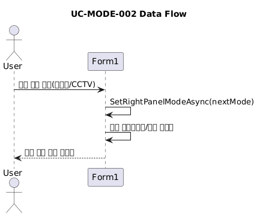

### 3) 로직 흐름 (Sequence Diagram)

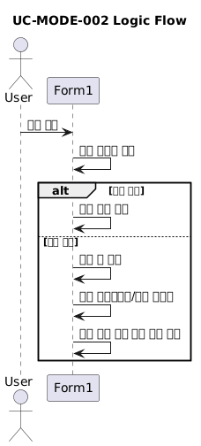

---

## UC-CMN-001 앱 실행 및 지도 준비

### 1) 클라이언트 기준 상세 설명

- 사용자는 앱을 실행하고 지도가 준비될 때까지 대기한다.
- 시스템은 UI를 초기화하고 WebView2 지도 로딩 완료 시 상태 메시지를 갱신한다.
- 완료 기준: 상태바에 `지도가 준비되었습니다.`가 표시된다.

### 2) 데이터 흐름 (Sequence Diagram)

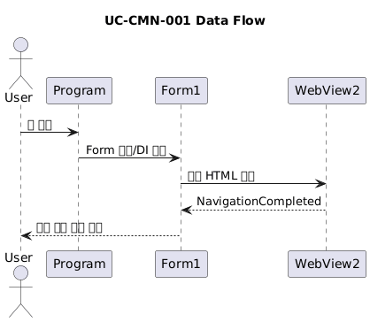

### 3) 로직 흐름 (Sequence Diagram)

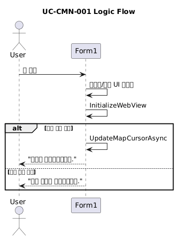

---

## UC-MODE-001 지도 모드 전환

### 1) 클라이언트 기준 상세 설명

- 사용자는 툴바에서 지도 모드를 `일반 모드` 또는 `주변 고속도로 선택 모드`로 전환한다.
- 시스템은 선택 모드 여부를 지도 커서/선택 상태에 반영한다.
- 완료 기준: `주변 고속도로 선택 모드`에서만 좌표 클릭 조회가 활성화된다.

### 2) 데이터 흐름 (Sequence Diagram)

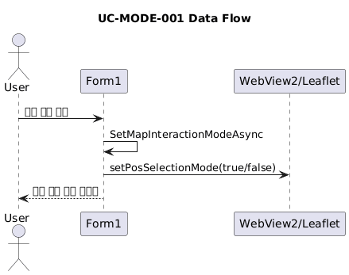

### 3) 로직 흐름 (Sequence Diagram)

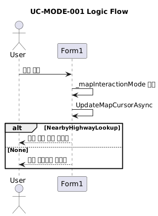

---

## UC-TRF-001 좌표 기반 혼잡도 조회

### 1) 클라이언트 기준 상세 설명

- 사용자는 지도 모드를 `주변 고속도로 선택 모드`로 바꾼 뒤 지도를 클릭한다.
- 클라이언트는 클릭 좌표와 현재 지도 bounds(min/max lat/lon)를 함께 전송한다.
- 시스템은 인접 고속도로를 식별하고, 각 고속도로별 VDS 혼잡도 정보를 조회한다.
- 조회 결과는 우측 패널 카드와 지도 마커/세그먼트로 표시된다.

### 2) 데이터 흐름 (Sequence Diagram)

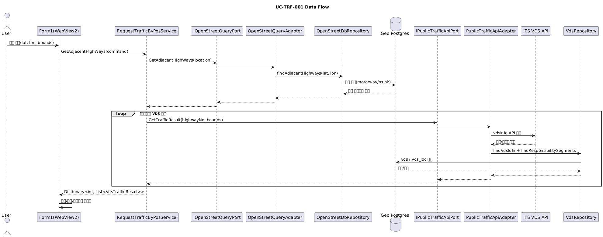

### 3) 로직 흐름 (Sequence Diagram)

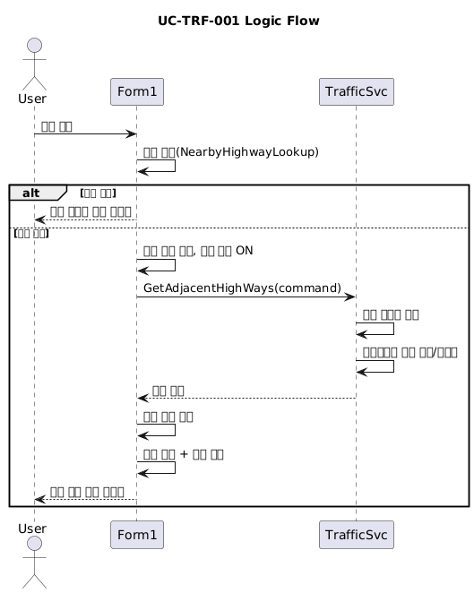

---

## UC-TRF-002 VDS 결과 시각화/동기화

### 1) 클라이언트 기준 상세 설명

- 사용자는 혼잡도 조회 결과를 지도와 우측 카드 리스트에서 동시에 확인한다.
- 지도의 VDS 마커를 클릭하면 해당 카드가 하이라이트된다.
- 선택 상태를 해제하면 하이라이트도 함께 해제된다.

### 2) 데이터 흐름 (Sequence Diagram)

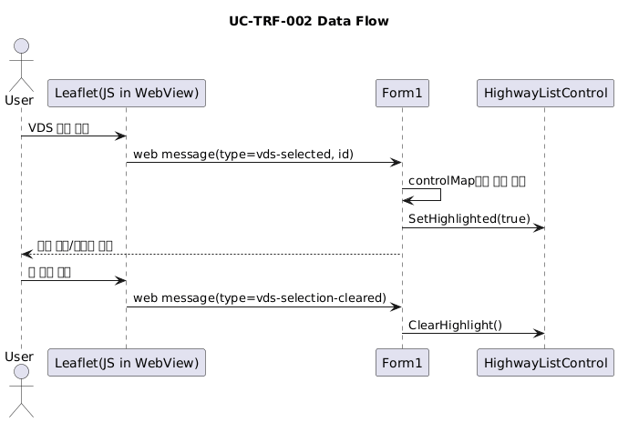

### 3) 로직 흐름 (Sequence Diagram)

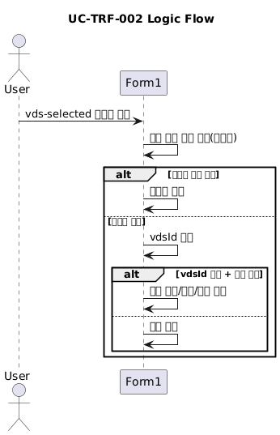

---

## UC-CTV-001 CCTV 모드 기반 조회

### 1) 클라이언트 기준 상세 설명

- 사용자는 좌측에서 우측 패널 모드를 `CCTV 모드`로 전환한다.
- 지도 클릭 시 선택 좌표 주변 고속도로 중 가장 근접한 고속도로를 고르고 CCTV를 조회한다.
- 필터링된 CCTV 목록이 우측 카드와 지도 CCTV 마커로 표시된다.

### 2) 데이터 흐름 (Sequence Diagram)

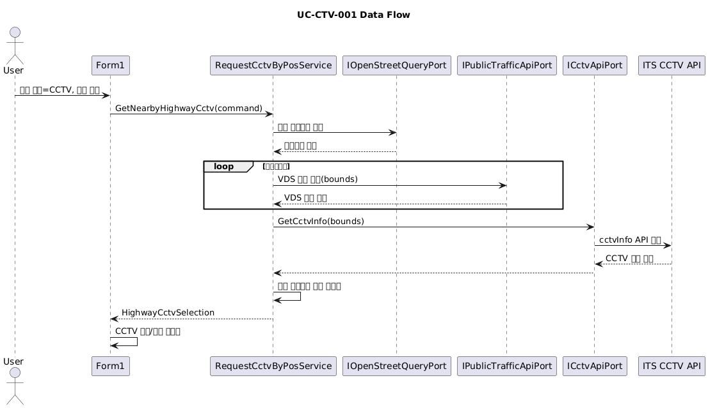

### 3) 로직 흐름 (Sequence Diagram)

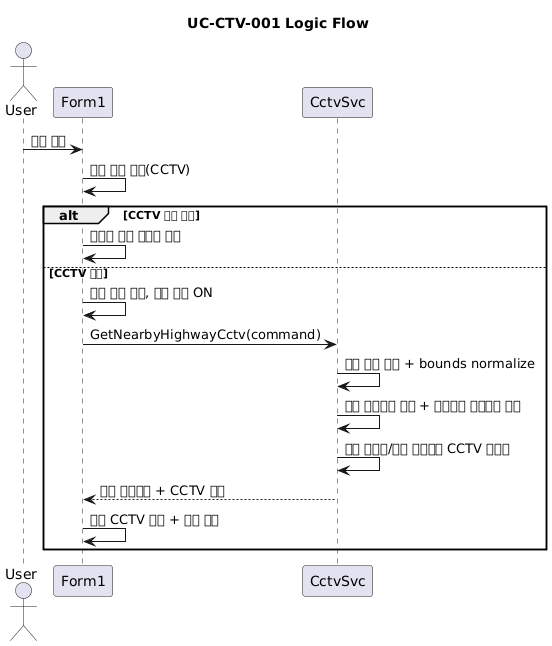

---

## UC-CTV-002 CCTV 상세 재생

### 1) 클라이언트 기준 상세 설명

- 사용자가 CCTV 카드를 클릭하면 지도에서 해당 CCTV 마커를 강조한다.
- 스트림 URL을 검증한 뒤 팝업 플레이어를 띄워 실시간 영상을 재생한다.
- 재생 창이 이미 열려 있으면 중복 실행을 막고 상태 메시지로 안내한다.

### 2) 데이터 흐름 (Sequence Diagram)

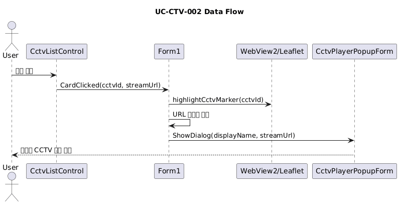

---

## UC-TRF-003 도로 구간 혼잡도 색상 시각화

### 1) 클라이언트 기준 상세 설명

- 사용자는 조회된 도로 구간의 혼잡도 레벨을 색상으로 확인한다.
- 시스템은 VDS 책임 구간 좌표를 가져와 혼잡도 레벨 색상으로 세그먼트를 그린다.
- 완료 기준: 구간이 레벨별 색상(`원활/보통/혼잡/정체`)으로 지도에 표시된다.

### 2) 데이터 흐름 (Sequence Diagram)

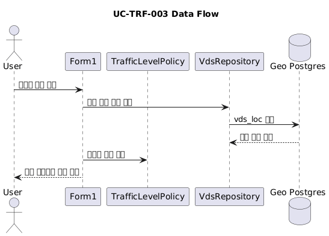

### 3) 로직 흐름 (Sequence Diagram)

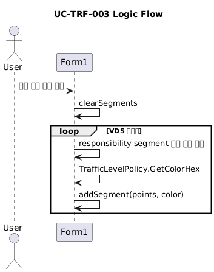

---

## UC-CTV-003 CCTV 선택 동기화

### 1) 클라이언트 기준 상세 설명

- 사용자는 CCTV 카드 또는 지도 CCTV 마커를 선택한다.
- 시스템은 카드 하이라이트, 스크롤, 지도 마커 포커스를 동기화한다.
- 완료 기준: 동일 CCTV가 지도와 목록에서 동시에 강조된다.

### 2) 데이터 흐름 (Sequence Diagram)

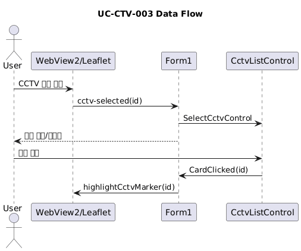

### 3) 로직 흐름 (Sequence Diagram)

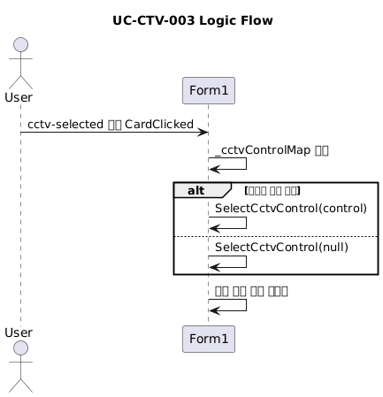

---

## UC-OPS-001 중복 요청 방지 및 최신 응답만 반영

### 1) 클라이언트 기준 상세 설명

- 사용자가 조회 중 같은 동작을 반복하면 시스템은 중복 요청을 제한한다.
- 트래픽/CCTV 조회는 각각 요청 버전을 증가시키고, 최신 요청 버전만 UI에 반영한다.
- 완료 기준: 지연된 이전 응답이 도착해도 화면은 최신 요청 결과만 유지된다.

### 2) 데이터 흐름 (Sequence Diagram)

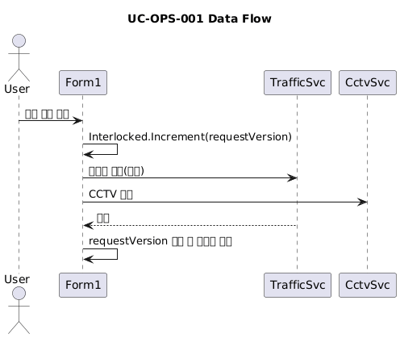

### 3) 로직 흐름 (Sequence Diagram)

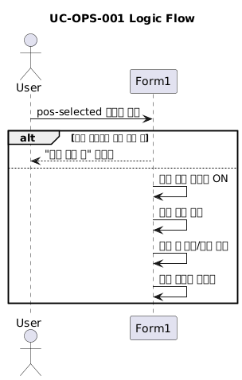

---

## UC-OPS-002 좌표/경계 검증 및 정규화

### 1) 클라이언트 기준 상세 설명

- 사용자가 좌표를 선택하면 시스템은 좌표/경계값 유효성을 확인한다.
- CCTV 조회는 bounds를 정규화하고 남한 범위로 clamp 처리한다.
- 완료 기준: 잘못된 좌표는 예외/실패 메시지로 처리되고, 비정상 경계 입력은 정규화되어 조회된다.

### 2) 데이터 흐름 (Sequence Diagram)

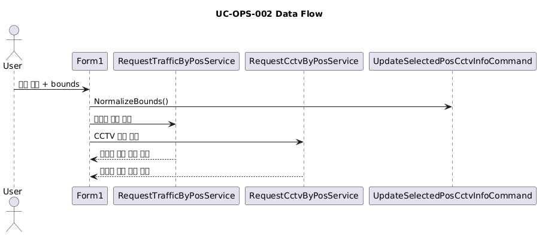

### 3) 로직 흐름 (Sequence Diagram)

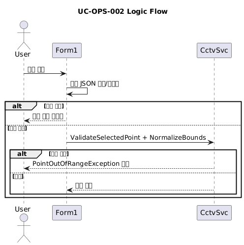

---

## UC-OPS-003 조회 상태 메시지/진행 인디케이터 갱신

### 1) 클라이언트 기준 상세 설명

- 사용자는 상태바를 통해 조회 시작/진행/완료/실패를 확인한다.
- 시스템은 단계별로 `SetStatusMessage`와 진행 인디케이터를 갱신한다.
- 완료 기준: 사용자가 현재 조회 상태를 상태바에서 즉시 구분할 수 있다.

### 2) 데이터 흐름 (Sequence Diagram)

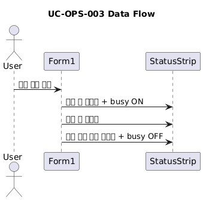

### 3) 로직 흐름 (Sequence Diagram)

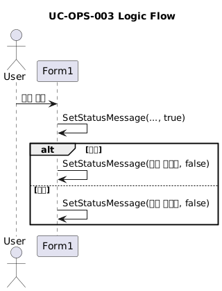

### 3) 로직 흐름 (Sequence Diagram)

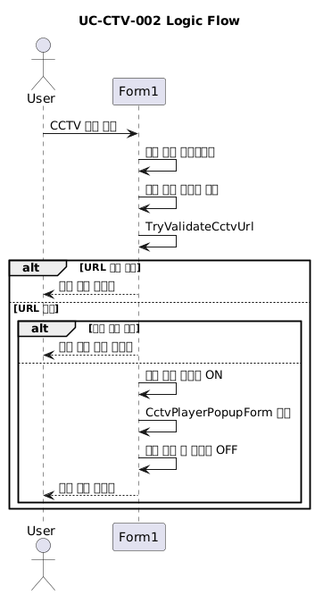
